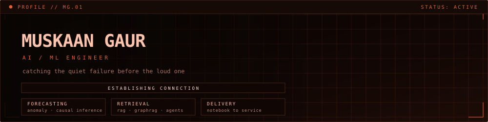

<p align="center">
  <a href="https://www.linkedin.com/in/muskaan-gaur" target="_blank">
    
  </a>
  <a href="mailto:muskaanmilli@gmail.com" target="_blank">
    
  </a>
  <a href="https://github.com/muskaangaur06" target="_blank">
    
  </a>
  <a href="https://huggingface.co/" target="_blank">
    
  </a>
</p>

<br/>

<table>
<tr><td>

### `01` &nbsp; ABOUT

Something is going wrong right now in a system somebody depends on, and the numbers still look fine. By the time a threshold trips, the useful window has closed. Nearly everything I build lives in the gap between those two moments: catch the drift while there is still time to act, then explain the cause well enough that someone will actually act on it.

The interesting problem is almost never the model. It is knowing what *normal* means for **this** system, and refusing to borrow that answer from somewhere else.

</td></tr>
</table>

<table>
<tr><td>

### `02` &nbsp; FOCUS

```
forecasting    anomaly detection and causal inference
retrieval      RAG, GraphRAG and agentic applications
delivery       research notebook through to deployed service
standard       evaluation is the deliverable
```

</td></tr>
</table>

<table>
<tr><td>

### `03` &nbsp; METHOD

**Constants come from the system in front of me.** Thresholds, weights and baselines get built from that system's own data. Inheriting them from a similar looking system is how you ship a model that is confidently wrong.

**A detection nobody can explain is a detection nobody uses.** Flagging an anomaly is the easy half. Tracing it to a cause, with statistical testing behind the claim, is what turns an alert into a decision.

**Deterministic where it counts, generative where it helps.** Search, ranking and scoring stay deterministic and testable. The model writes prose. When generated text fails its check against the source, a rule based version ships instead, so the system degrades rather than lies.

**Evaluation is the deliverable.** Anyone can post a number. The work is building the split that makes the number mean something.

</td></tr>
</table>

<table>
<tr><td>

### `04` &nbsp; STACK

<p>
  
  
  
  
  
  
  
  
</p>
<p>
  
  
  
  
  
  
  
  
</p>
<p>
  
  
  
  
  
  
  
  
</p>

</td></tr>
</table>

<br/>

<p align="center">
  
</p>

<br/>

<p align="center">
  <code>IF YOU ARE BUILDING SOMETHING THAT HAS TO KEEP WORKING</code>
</p>

<p align="center">
  <a href="https://www.linkedin.com/in/muskaan-gaur" target="_blank">
    
  </a>
</p>
